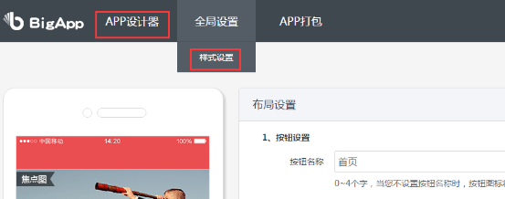
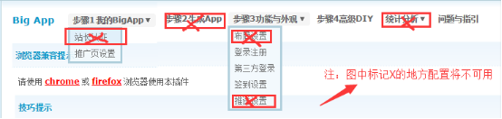

# 开源目的

通过使用该源码，开发者可以迅速地将Discuz论坛迁移到iOS客户端中。不需要任何的开发工作即可拥有属于自己论坛的iOS客户端。

# 准备工作

在使用源码之前必须先在Discuz论坛中安装BigApp插件。

#### 一、插件安装

应用中心 -> 插件 -> 搜索bigapp -> 点击BigApp手机客户端 -> 安装应用即可

安装步骤参考 [Bigapp安装方法](http://addon.discuz.com/?@bigapp.plugin.doc/install_step)

#### 二、配置插件

1、登录注册模式（原生登录、web登录、原生注册、web注册、允许客户端更换头像）

2、第三方登录开关（QQ登录、微信登录开关）

3、签到设置（APP签到设置）

4、高级DIY设置如下（APP设计器、样式设置）, 如图：

> 注：如下配置将不可用（站长认证、生成App、布局设置、推送设置、统计分析）, 如图：
> 

# 使用说明

1、使用XCode打开Clan.xcodeproj项目文件。

2、在XCode左侧的文件列表中找到ThemeStyle.plist文件（路径：Clan/Application/ThemeStyle.plist）。

3、对Plist文件中的字段进行配置，其中配置项说明如下表所示：

|名称|说明|
|--------------------|-------------------------|
|YZBaseURL|论坛地址|
|YZBasePath|插件接口的路径，固定为：api/mobile/iyz_index.php|
|APPSTYLE|应用样式。 1.tab风格， 2.侧边栏风格|
|YZSegMent|主题颜色|
|YZBBSName|论坛名称，作为某些页面的视图标题（如首页）以及分享时的出处。|
|kAPP_DOWNLOAD_URL|应用下载地址，用于跳转AppStore评价应用|
|ShareAppkeySina|新浪微博的AppKey（用于分享）|
|ShareAppSecretSina|新浪微博的AppSecret（用于分享）|
|ShareAppRedirectUriSina|新浪微博的授权回调地址（用于分享）|
|ShareAppkeyWechat|微信的AppKey（用于分享、登录）|
|ShareAppSecretWechat|微信的AppSecret（用于分享、登录）|
|ShareAppkeyTecent|QQ的AppKey（用于分享、登录）|
|ShareAppSecretTecent|QQ的AppSecret（用于分享、登录）|

> 注：对于新浪、微信、QQ的应用信息设置，如果没有使用相关平台功能，可以不进行设置。

4、编译运行应用。
